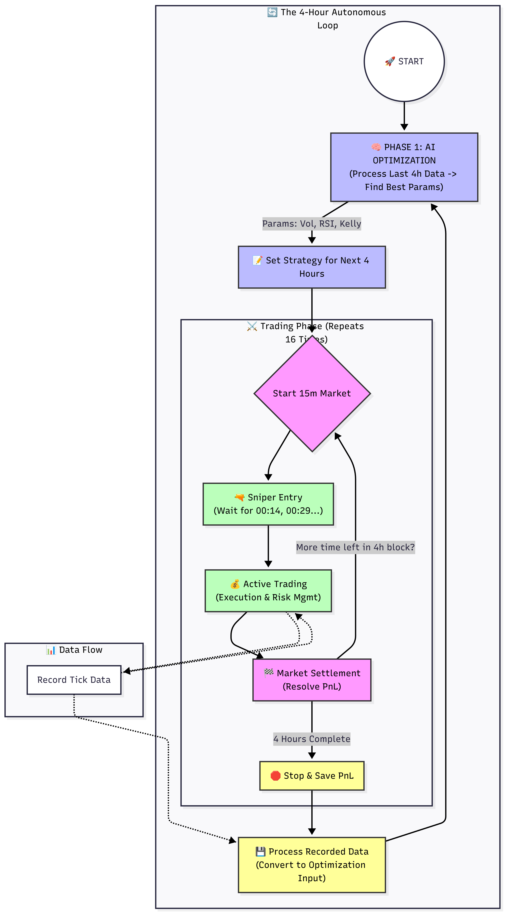

# ---

# **🤖 UpDownPolyBot - Polymarket Probability Trading Bot**

## **Overview**

The **Polymarket Probability Trading Bot** is a statistical arbitrage engine designed specifically for Polymarket's **"Up/Down" (Binary Option)** markets.

Unlike simple directional betting, this bot treats every market as a financial derivative. It calculates the _fair value_ of an outcome using advanced stochastic calculus and compares it to the live market price (CLOB). When the market price deviates from the mathematical fair value by a sufficient margin (the **Edge**), the bot executes a trade.

The system is fully autonomous, self-correcting, and capable of optimizing its own parameters in real-time based on changing market conditions.

## ---

## **🧠 Core Strategy & Logic**

The bot's decision-making process is built upon a modular quantitative framework.

### **1. The Probability Engine**

At the heart of the bot is a sophisticated probability engine that models asset price movements. The bot dynamically selects between three statistical models depending on the asset class and market regime:

#### **A. Geometric Brownian Motion (GBM)**

The industry standard for modeling stock and crypto prices (the foundation of Black-Scholes). It assumes asset prices have a constant drift and volatility but move randomly.

- **Formula:** $dS_t = \mu S_t dt + \sigma S_t dW_t$
- **Best For:** Standard trending markets (BTC, ETH) where price changes are proportional to the current price.

#### **B. Gaussian (Normal Distribution)**

A simplified model that assumes price distribution at expiry will be Bell-shaped (Normal) around the current price.

- **Formula:** $P(S_T > K) = 1 - \Phi\left(\frac{K - \mu}{\sigma\sqrt{T}}\right)$
- **Best For:** Extremely short timeframes (< 5 minutes) where log-normal and normal distributions converge, offering faster computation.

#### **C. Ornstein-Uhlenbeck (OU)**

A mean-reverting model. Unlike GBM, which lets prices wander anywhere, OU assumes prices tend to return to a long-term mean.

- **Formula:** $dX_t = \theta(\mu - X_t)dt + \sigma dW_t$
- **Best For:** Stablecoins, pegged assets, or highly ranging markets where price is strictly bound.

### ---

### **2. Dynamic Volatility (Session Awareness and EWMA)**

Volatility ($\sigma$) is the most critical input for any probability model. If you overestimate volatility, you overpay for options. If you underestimate it, you miss opportunities.

This bot uses a **Hybrid Volatility System**:

#### **A. Session Awareness**

Crypto markets are 24/7, but human activity is not. The bot automatically adjusts its baseline volatility assumptions based on the active global trading session to prevent overpaying during quiet hours.

| Time (UTC)        | Session         | Volatility Multiplier | Market Behavior                       |
| :---------------- | :-------------- | :-------------------- | :------------------------------------ |
| **00:00 - 08:00** | **Asian 🌏**    | **0.60x**             | Low volatility, ranging prices.       |
| **08:00 - 13:00** | **London 🇬🇧**   | **0.85x**             | Medium volatility, breakouts start.   |
| **13:00 - 00:00** | **New York 🇺🇸** | **1.00x**             | High volatility, major news/moves.    |
| **Weekend**       | **Weekend 🏖️**  | **0.60x**             | (Sat/Sun) Forced low volatility mode. |

#### **B. EWMA (Exponentially Weighted Moving Average)**

Static history is not enough. The bot calculates real-time volatility using EWMA, which gives more weight to the most recent price ticks.

**The Final Calculation:**

The bot blends long-term data with real-time shock detection:

$$\sigma_{final} = 0.60 \times (\text{Historical Vol} \times \text{Session Mult}) + 0.40 \times \text{EWMA Vol}$$

### ---

### **3. Trend Following**

While standard probability models assume random walks, crypto markets exhibit **Momentum**. The bot includes an optional Trend Module to adjust probabilities.

- **Logic:** The bot calculates a Fast EMA (Exponential Moving Average) and Slow EMA.
- **Impact:**
  - If Price > EMA, the market is in an **UP Trend**.
  - The probability of the "YES" outcome is boosted by a **Trend Factor** (e.g., +5%).
  - _Result:_ The bot becomes more aggressive on trend-aligned bets and conservative on counter-trend bets.

### **4. RSI Adjustments**

To prevent buying the top or selling the bottom, the bot incorporates the **Relative Strength Index (RSI)**.

- **Logic:** Uses a 14-period RSI to detect overbought/oversold conditions.
- **Impact:** The adjustment is dynamic based on distance from the neutral 50 level.
  - **RSI > 70 (Overbought):** The bot _decreases_ the probability of an Up move (anticipating a pullback).
  - **RSI < 30 (Oversold):** The bot _increases_ the probability of an Up move (anticipating a bounce).
- **Formula:** $P_{adj} = P_{model} - (\text{RSI}_{val} - 50) \times \text{ImpactFactor}$

### ---

### **5. Smart Cooldown & Averaging**

To prevent "spamming" bets at the same price, the bot uses a **Smart Cooldown** mechanism.

- **Standard Rule:** After placing a bet, the bot enters a "Cooldown State," waiting **X ticks** or seconds before considering the same bet again.
- **The Exception (Averaging Down):** If the market moves _against_ your position (e.g., price drops after you bought YES), the mathematical edge often _increases_. In this specific scenario, the bot **bypasses the cooldown** to "average down," lowering the entry price and capturing the enhanced value.

### ---

### **6. Liquidity & Spread Guard**

In high-frequency markets, wide spreads are the _silent killer_ of profitability. If the gap between the **YES** and **NO** price is too wide, you are effectively paying a massive fee to enter the trade.

- **The Logic:** Before every bet, the bot performs a Market Efficiency Check.  
  $$\text{Implied Cost} = \text{Ask(YES)} + \text{Ask(NO)}$$
- **The Rule:** If Implied Cost > 1.04 (meaning the spread cost > 4 cents), the bot **aborts the trade**.
- **The Benefit:** This filters out low-liquidity moments where slippage would mathematically guarantee a loss over time, ensuring you only trade when the market is tight and efficient.

### ---

### **7. Kelly Sizing**

The bot does not use fixed bet sizes. Instead, it utilizes the **Kelly Criterion**, the gold standard for bankroll management in probability theory.

- **Formula:** $f^* = \text{Kelly Fraction} \times \frac{bp - q}{b}$
  - $p$: Probability of winning (calculated by our engine).
  - $b$: Odds received from the market.
  - $q$: Probability of losing ($1-p$).
- **Benefit:**
  - If the Edge is high, the bet size increases to maximize growth.
  - If the Edge is slim, the bet size decreases to minimize risk.
  - This mathematically maximizes the geometric growth rate of the portfolio while preventing ruin.

### ---

### **8. Max Cycle Investment**

Since Polymarket 15-minute markets expire quickly, holding too much risk in a single expiration cycle is dangerous.

- **Logic:** The bot enforces a **Hard Cap** on total dollars invested per 15-minute cycle (e.g., $50 max).
- **Security Threat:** Without this, a "black swan" event (like a sudden crash) in a single 15-minute window could wipe out a significant portion of the bankroll. This cap ensures that no single bad cycle ruins the strategy.

### **9. Minimal Edge**

The bot refuses to gamble; it only trades when it has a statistical advantage.

- **Logic:** It calculates the Expected Value (EV) of every trade.  
  $$\text{Edge} = \text{My Probability} - \text{Market Probability}$$
- **Rule:** If Edge < Min_Edge_Threshold (e.g., 5%), the trade is skipped.
- **Security Threat:** Trading without a minimal edge results in a "Coin Flip" strategy where spread fees and commissions slowly drain the account (death by a thousand cuts).

### ---

### **10. Impulse Detection (Binance vs Pyth)**

Polymarket settles prices based on the **Pyth Oracle**, which updates slightly slower than centralized exchanges (CEX) like Binance.

- **Logic:** The bot subscribes to the **Binance WebSocket** (fastest feed) and compares it to the **Pyth** price.
- **The Edge:** If Binance moves sharply (Impulse) but Pyth hasn't updated yet, the bot "knows the future" for a few seconds. It can bet on the direction Pyth _will_ move.
- **Security Threat:** Without this, the bot is trading on "lagged" data and will often be the victim of other HFT bots ("picked off").

### ---

### **11. Recording**

Data is the fuel for optimization.

- **Function:** The bot can run in --record mode. It logs every price tick, oracle update, spread change, and indicator value into a structured CSV file.
- **Use:** This creates a "Time Capsule" of market conditions. The data is used not just for charts, but to _replay_ history and train the AI.

### **12. Replaying**

The bot features a **Time-Travel Simulator**.

- **Function:** You can feed a recorded CSV file into the bot using the --replay_file argument.
- **How it works:** The bot processes the file line-by-line as if it were happening live. It executes trades virtually and reports the PnL (Profit and Loss) exactly as it would have occurred in real life.
- **Benefit:** Allows risk-free testing of new strategies on yesterday's difficult market conditions.

### ---

### **13. Params Optimizations**

Params optimization is assured by integration of **Optuna**, an advanced hyperparameter optimization framework used in machine learning. It is used to find best parameters like trend impact, RSI impact, kelly sizing, minimal edge, mean volatility, max cycle investment and more.

- **How it works:**
  1. Optuna takes a recorded dataset (from #11).
  2. It runs thousands of simulations (using Replay #12), tweaking parameters like Volatility Multipliers, RSI Impact, and Kelly Fractions.
  3. It uses the **TPE (Tree-structured Parzen Estimator)** algorithm to "learn" which combination of settings yields the highest profit.
- **Benefit:** Instead of guessing "What is the best RSI setting?", the AI tells us mathematically.

### **14. Autonomous Work (Self-Optimizing Loop)**

The pinnacle of this project is the **Auto-Trade Loop**, which combines all features into a self-improving organism.

**The Infinite Loop:**

1. **Phase 1 (Bootstrap):** The bot records market data for X hours.
2. **Phase 2 (Optimization):** The system launches the Optimizer on that fresh X-hour dataset. It finds the "Winning Strategy" for the _current_ market conditions.
3. **Phase 3 (Deployment):** The bot launches the Trading Engine using those optimized parameters.
4. **Phase 4 (Wait & Sync):** The bot waits for the precise "Sniper Entry" moment (last minute of the 15-minute cycle).
5. **Phase 5 (Trade & Record):** It trades live for X hours while simultaneously recording the _next_ batch of data.
6. **Repeat:** After the X hours ends, it re-optimizes on the new data and updates itself.

**Result:** A bot that adapts its aggression, volatility, and risk settings every single hour to match the ever-changing crypto market.

Figure 14 — AI PnL Optimization Flow
